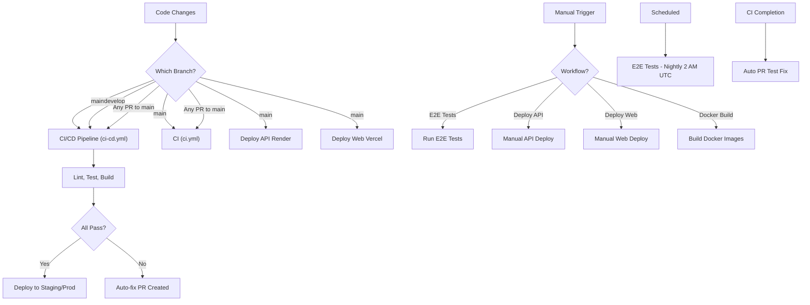

# GitHub Actions Workflow Decision Tree

## When Does Each Workflow Trigger?



---

## Workflow Trigger Reference

### 🔄 Automatic Triggers (No Manual Action Required)

#### 1. **CI/CD Pipeline** (`ci-cd.yml`)

**Triggers When:**

- ✅ Push to `main` or `develop`
- ✅ Pull request to `main`

**Excludes:**

- Changes to `archive/` directory
- Changes to docs/README files only

**Jobs Run (in parallel where possible):**

1. Lint & Type Check
2. Test (with coverage)
3. Build API
4. Build Web
5. Security Scan
6. Deploy (if on main)
7. Load Test (if on main)

**Status Badge:**

```markdown

```

---

#### 2. **CI** (`ci.yml`)

**Triggers When:**

- ✅ Push to `main`
- ✅ Pull request (any branch)

**Excludes:**

- Changes to `archive/` directory

**Purpose:** Quick lightweight CI checks (faster feedback than ci-cd.yml)

**Jobs Run:**

1. Package guards (no npm lockfiles)
2. Install
3. Test
4. Lint
5. Build

---

#### 3. **Deploy API (Render)** (`render-deploy.yml`)

**Triggers When:**

- ✅ Push to `main` (automatic)
- ✅ Manual workflow_dispatch

**Environment:** Production

**Requirement:** `RENDER_DEPLOY_HOOK_URL` secret configured

**Process:**

1. Trigger Render deploy hook
2. Wait for Render to rebuild
3. Health check API endpoint
4. Publish deployment summary

---

#### 4. **Deploy Web (Vercel)** (`vercel-deploy.yml`)

**Triggers When:**

- ✅ Push to `main` (automatic)
- ✅ Manual workflow_dispatch
- ✅ Called from `cd.yml` workflow

**Environment:** Production

**Requirements:**

- `VERCEL_TOKEN` secret
- `VERCEL_ORG_ID` secret
- `VERCEL_PROJECT_ID` secret

**Process:**

1. Build Web app
2. Pull Vercel environment
3. Deploy to production
4. Health check
5. Comment on PR (if applicable)

---

#### 5. **E2E Tests** (`e2e.yml`)

**Triggers When:**

- ✅ Manual workflow_dispatch
- ✅ Scheduled daily at 2 AM UTC

**Services Started:**

- PostgreSQL 15
- Redis 7
- Web server (port 3000)
- API server (port 4000)

**Browsers Tested:**

- Chromium
- Firefox
- WebKit

---

#### 6. **Auto PR Test Fix** (`auto-pr-test-fix.yml`)

**Triggers When:**

- ✅ CI workflow completes with **failure** status
- ✅ Manual workflow_dispatch

**Purpose:** Auto-create PR with test fixes when CI fails

**Process:**

1. Run tests to identify failures
2. Execute `scripts/auto-fix-tests.sh`
3. Create PR if fixes applied
4. Label: `automated`, `ci-fix`

---

#### 7. **Docker Build** (`docker-build.yml`)

**Triggers When:**

- ✅ Push to `main` (automatic)
- ✅ Manual workflow_dispatch

**Images Built:**

- API image
- Web image
- Mobile image (if applicable)

**Registry:** Docker Hub / GitHub Container Registry

---

#### 8. **GitHub Pages** (`deploy-pages.yml`)

**Triggers When:**

- ✅ Push to `main`
- ✅ Manual workflow_dispatch

**Purpose:** Build static docs and deploy to GitHub Pages

**Command:** `pnpm run build:pages`

**URL:** https://MrMiless44.github.io/Infamous-freight-enterprises/

---

#### 9. **Security Scans** (Various)

**CodeQL** - Runs on push and PR
**Trivy** - Runs as part of CI/CD

---

### 🎬 Manual Triggers (workflow_dispatch)

You can manually trigger any workflow from GitHub Actions tab:

1. Go to **Actions** tab
2. Select workflow from left sidebar
3. Click **Run workflow** button
4. Select branch (default: main)
5. Click **Run workflow**

**Common Manual Triggers:**

- Deploy to production (if auto-deploy disabled)
- Run E2E tests on-demand
- Run Docker builds
- Re-deploy if automatic failed

---

### ⏰ Scheduled Triggers

#### E2E Tests

- **Time:** Every night at 2 AM UTC
- **Branch:** main
- **Frequency:** Daily
- **Cron:** `0 2 * * *`

---

## Workflow Dependencies

```
Push to main
    ↓
    ├─→ Lint & Type Check ──┐
    ├─→ Test ────────────────┤
    ├─→ Security Scan ───────┤──→ Build ──→ Deploy
    └─→ CI (lightweight) ────┘
```

**Key Points:**

- Build requires Lint + Test to pass
- Deploy requires Build to succeed
- If any critical job fails, dependent jobs are skipped
- Some jobs use `continue-on-error: true` (warnings don't block)

---

## Preventing Workflow Runs

### Don't Trigger CI:

- Commit message with `[skip ci]` or `[ci skip]`

```bash
git commit -m "docs: Update README [skip ci]"
```

### Don't Trigger E2E:

- Scheduled runs can't be skipped
- Manual runs must be triggered explicitly

---

## Conflict Prevention

### Multiple Workflows Running Simultaneously?

**Concurrency Groups** prevent overlapping runs:

```yaml
concurrency:
  group: ${{ github.workflow }}-${{ github.ref }}
  cancel-in-progress: true
```

**Behavior:**

- Only ONE run per workflow per branch at a time
- Older runs automatically cancelled
- Prevents resource conflicts

**Examples:**

- If 3 commits pushed quickly to main, only latest CI/CD runs
- Manual deploy while automatic deploy in progress → cancels automatic

---

## Monitoring Workflow Status

### GitHub Actions Dashboard

```
https://github.com/MrMiless44/Infamous-freight-enterprises/actions
```

### View Specific Workflow Runs

```bash
# List all runs for ci-cd.yml
gh run list --workflow ci-cd.yml

# View specific run
gh run view <run-id> --log

# Watch run in real-time
gh run watch <run-id>

# Cancel running workflow
gh run cancel <run-id>
```

### Branch Protection Rules

Settings → Branches → Branch Protection Rules

**Require status checks to pass:**

- ✅ CI/CD Pipeline
- ✅ CI
- ✅ CodeQL
- ✅ All deployments

---

## Common Issues & Solutions

### ❌ "Workflow not triggering on push"

**Solutions:**

- Verify branch matches trigger condition (`main` or `develop`)
- Check path filters (changes in `archive/` don't trigger)
- Remove `[skip ci]` from commit message if present
- Wait 1-2 minutes (sometimes GitHub is slow)

---

### ❌ "Deploy not running after CI completes"

**Solutions:**

- Verify you're on `main` branch
- Check deploy secrets are configured
- Manual deployment might have cancelled automatic one
- View logs to see actual error

---

### ❌ "Only one workflow running, others skipped"

**Root Cause:** Concurrency limits or branch protection

**Solutions:**

- Check if higher-priority workflow is running
- Cancel existing runs if stuck: `gh run cancel <run-id>`
- Review concurrency settings

---

### ❌ "E2E tests not running on schedule"

**Solutions:**

- Scheduled workflows need GitHub Actions enabled on repo
- E2E tests only run on `main` branch
- Check workflow `if:` conditions aren't blocking it
- View `.github/workflows/e2e.yml` cron schedule

---

## Testing Workflows Locally

### Use `act` to run GitHub Actions locally

```bash
# Install act
brew install act  # macOS
# or visit: https://github.com/nektos/act

# Run workflow locally
act push -j lint

# Run all jobs
act push

# Run with custom event data
act push -e event.json
```

---

## Validating Workflow Syntax

### Check YAML syntax

```bash
# Install actionlint
brew install actionlint

# Validate all workflows
actionlint .github/workflows/

# Validate specific workflow
actionlint .github/workflows/ci-cd.yml
```

---

## Next Steps

1. **Monitor your workflows:** Watch first few runs after changes
2. **Set up alerts:** Configure Slack notifications (optional)
3. **Review logs:** Check "Run workflow" → click run → view logs
4. **Optimize:** Profile slow jobs and optimize as needed
5. **Document:** Keep team informed of workflow changes

---

**Last Updated:** December 31, 2025
**For Questions:** See [WORKFLOW_GUIDE.md](./.github/WORKFLOW_GUIDE.md)
