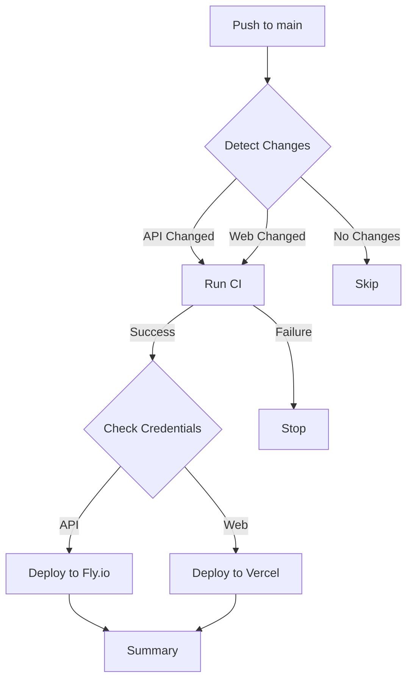

# 🚀 Auto-Deployment Configuration - Complete

## ✅ What's Been Fixed

### 1. **Unified CI/CD Pipeline**

- **`.github/workflows/auto-deploy.yml`** - Smart deployment with change detection
- **`.github/workflows/cd.yml`** - Enhanced with CI checks before deployment
- **`.github/workflows/ci.yml`** - Upgraded to Node 20, supports workflow_call

### 2. **Deployment Configuration**

- **`vercel.json`** - Proper monorepo configuration for Vercel
- **`.vercelignore`** - Optimized to exclude API/mobile code
- **`fly.toml`** - Production-ready Fly.io config with health checks

### 3. **Smart Change Detection**

Auto-deploy only detects and deploys what changed:

- API changes → Deploy to Fly.io
- Web changes → Deploy to Vercel
- Shared package changes → Deploy both

## 🎯 How Auto-Deploy Works

### Trigger: Push to Main

```bash
git push origin main
```

### What Happens:

1. **Change Detection** - Analyzes which apps changed
2. **CI Checks** - Runs tests, linting, builds
3. **Deploy API** - If API changed (to Fly.io)
4. **Deploy Web** - If Web changed (to Vercel)
5. **Summary** - Reports deployment status

### Manual Trigger

```bash
# Via GitHub UI: Actions → Auto Deploy → Run workflow
# Or with GitHub CLI:
gh workflow run auto-deploy.yml
```

## 📋 Required Secrets

Set these in GitHub Settings → Secrets:

### For Fly.io (API)

```bash
# Get your token from: https://fly.io/user/personal_access_tokens
FLY_API_TOKEN=<your-fly-token>
```

### For Vercel (Web)

```bash
# Get your token from: https://vercel.com/account/tokens
VERCEL_TOKEN=<your-vercel-token>

# Optional: Custom API URL
NEXT_PUBLIC_API_URL=https://infamous-freight-api.fly.dev
```

## 🔧 Setup Instructions

### 1. Configure GitHub Secrets

```bash
# Using GitHub CLI
gh secret set FLY_API_TOKEN
gh secret set VERCEL_TOKEN
gh secret set NEXT_PUBLIC_API_URL

# Or via GitHub UI:
# https://github.com/MrMiless44/Infamous-freight-enterprises/settings/secrets/actions
```

### 2. Initialize Fly.io (First Time)

```bash
# Authenticate
export PATH="/home/vscode/.fly/bin:$PATH"
flyctl auth login

# Deploy manually first time
flyctl deploy

# Set required secrets
flyctl secrets set JWT_SECRET=$(openssl rand -base64 32) -a infamous-freight-api
flyctl secrets set DATABASE_URL="<postgres-url>" -a infamous-freight-api
```

### 3. Initialize Vercel (First Time)

```bash
# Install Vercel CLI
npm i -g vercel

# Login
vercel login

# Link project (run from project root)
vercel link

# Set environment variables
vercel env add NEXT_PUBLIC_API_URL production
# Enter: https://infamous-freight-api.fly.dev
```

## 🚦 Deployment Status

### Check Current Status

```bash
./scripts/check-deployments.sh
```

### View Live Deployments

- **Web**: https://infamous-freight-enterprises.vercel.app
- **API**: https://infamous-freight-api.fly.dev/api/health

### GitHub Actions Dashboard

https://github.com/MrMiless44/Infamous-freight-enterprises/actions

## 📊 Deployment Workflows

### Auto-Deploy Workflow

**File**: `.github/workflows/auto-deploy.yml`

- Triggers: Push to main, Manual dispatch
- Features: Change detection, smart deployments, status summary

### CD Workflow (Legacy)

**File**: `.github/workflows/cd.yml`

- Triggers: Push to main
- Features: Parallel API + Web deployment

### Individual Deployments

- **API**: `.github/workflows/fly-deploy.yml`
- **Web**: `.github/workflows/vercel-deploy.yml`

## 🔄 Deployment Flow



## 🛠️ Manual Deployment

### Deploy API Only

```bash
# Via GitHub Actions
gh workflow run fly-deploy.yml

# Or locally
flyctl deploy
```

### Deploy Web Only

```bash
# Via GitHub Actions
gh workflow run vercel-deploy.yml

# Or locally
vercel --prod
```

### Deploy Both

```bash
# Via GitHub Actions
gh workflow run auto-deploy.yml

# Or locally
flyctl deploy && vercel --prod
```

## 🐛 Troubleshooting

### API Deployment Fails

**Check Fly.io logs:**

```bash
flyctl logs -a infamous-freight-api
```

**Common issues:**

- Missing secrets: `flyctl secrets list -a infamous-freight-api`
- Build errors: Check GitHub Actions logs
- Health check failing: Test `/api/health` endpoint

### Web Deployment Fails

**Check Vercel logs:**

```bash
vercel logs infamous-freight-enterprises
```

**Common issues:**

- Missing environment variables
- Build errors in Next.js
- Wrong build command in vercel.json

### Workflow Not Triggering

**Check:**

1. Secrets are set correctly
2. Branch protection rules
3. Workflow file syntax: `gh workflow view auto-deploy.yml`
4. Recent commits didn't skip deploy with `[skip ci]`

## 📈 Monitoring

### GitHub Actions Status Badge

Add to README.md:

```markdown
[](https://github.com/MrMiless44/Infamous-freight-enterprises/actions/workflows/auto-deploy.yml)
```

### Deployment Notifications

**Option 1: Slack**
Add to workflow:

```yaml
- name: Notify Slack
  uses: 8398a7/action-slack@v3
  with:
    status: ${{ job.status }}
    webhook_url: ${{ secrets.SLACK_WEBHOOK }}
```

**Option 2: Discord**

```yaml
- name: Notify Discord
  uses: sarisia/actions-status-discord@v1
  with:
    webhook: ${{ secrets.DISCORD_WEBHOOK }}
```

## 🔐 Security Best Practices

1. **Rotate tokens every 90 days**

   ```bash
   # Fly.io
   flyctl tokens create

   # Vercel
   # https://vercel.com/account/tokens
   ```

2. **Use environment-specific secrets**
   - Production secrets in GitHub
   - Staging secrets separate
   - Never commit secrets to git

3. **Enable branch protection**
   ```bash
   # Require PR reviews before merging to main
   # Require status checks to pass
   ```

## 🎯 Success Criteria

After setup, you should have:

- ✅ Auto-deploy on push to main
- ✅ CI checks pass before deployment
- ✅ Change detection working
- ✅ API live at https://infamous-freight-api.fly.dev
- ✅ Web live at https://infamous-freight-enterprises.vercel.app
- ✅ Deployment status in GitHub Actions
- ✅ Health checks passing

## 📚 Related Documentation

- [FLY_TROUBLESHOOTING.md](FLY_TROUBLESHOOTING.md) - Fly.io debugging
- [FLY_MONITORING.md](FLY_MONITORING.md) - Monitoring & alerts
- [FLY_RECOMMENDATIONS.md](FLY_RECOMMENDATIONS.md) - Best practices

## 🚀 Quick Commands

```bash
# Check deployment status
./scripts/check-deployments.sh

# View recent deployments
gh run list

# View specific workflow runs
gh run list --workflow=auto-deploy.yml

# Watch a deployment in progress
gh run watch

# Trigger manual deployment
gh workflow run auto-deploy.yml

# View deployment logs
gh run view --log
```

---

**Status**: ✅ Auto-deployment configured and ready
**Last Updated**: 2026-01-01
